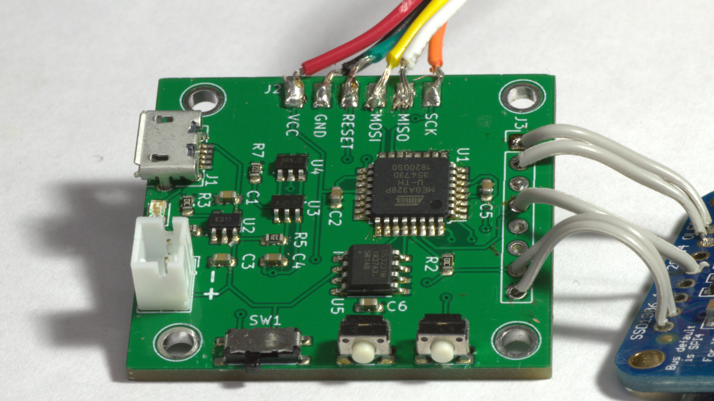
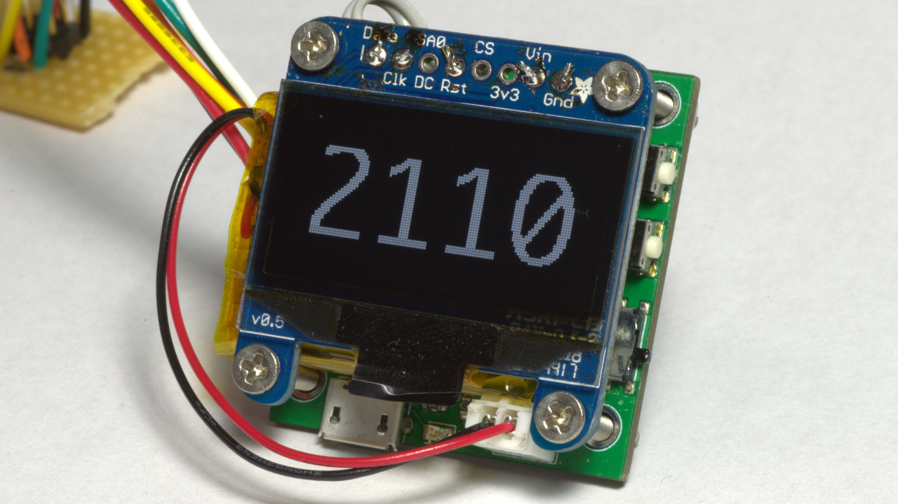
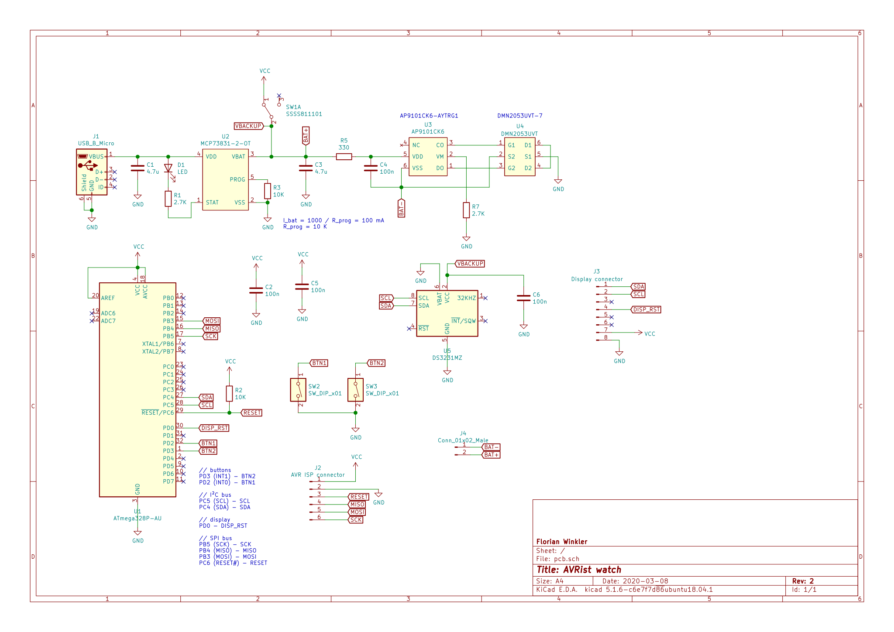

# AVRist-watch

A DIY project that involves an ATmega328p that controlls a small monochrome OLED display powered by a chargable LiPo battery - or in short: a digital wrist watch.

## Features

- **Real Time Clock**: An IC keeps track of the current date and time even if the display and microcontroller is turned off.

- **Li-Po battery management**: The board features a charge controller that allows charging the battery via Micro USB. Another IC protects the battery from over-charging and over-discharging.

- **OLED-Display**: A monochrome 128x64 pixel OLED display is used to show the current time.

- **Energy Efficiency**: After displaying the current time for a couple of seconds the display turns off and the microcontroller enters a sleep mode. This saves battery power.

## Images

## Schematic

